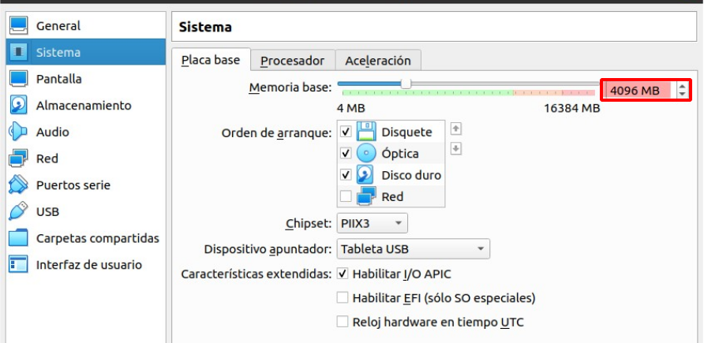
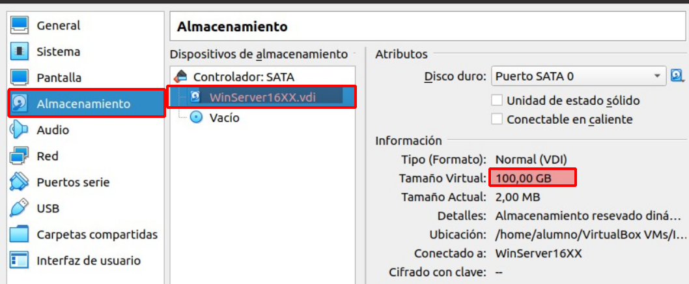

# Instalación de Controlador de Dominio en Winodws Server

## Indice 

## Definición 

Un **Controlador de Dominio en Windows Server** es un servidor que administra la autenticación de usuarios, autorización de accesos a recursos de red y la administración de políticas de grupo en un dominio de red. Al instalar un **Controlador de Dominio**, se establece una estructura jerárquica de dominios en la red, lo que permite centralizar la administración de usuarios, grupos y recursos de red. También facilita la implementación de políticas de seguridad y la replicación de información entre varios **Controladores de Dominio** en la red.

## 1. Creación Máquina Virtual 

## 1.2 Configuración

Modificamos la memoria base vamos a utilizar , y añadimos 4GB para que este mejor 

Almacenamiento del disco duro , es de 100GB

