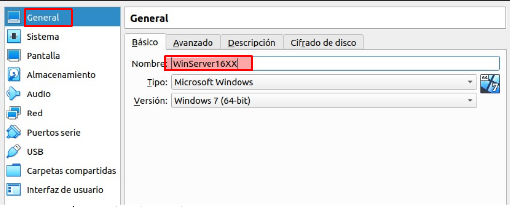
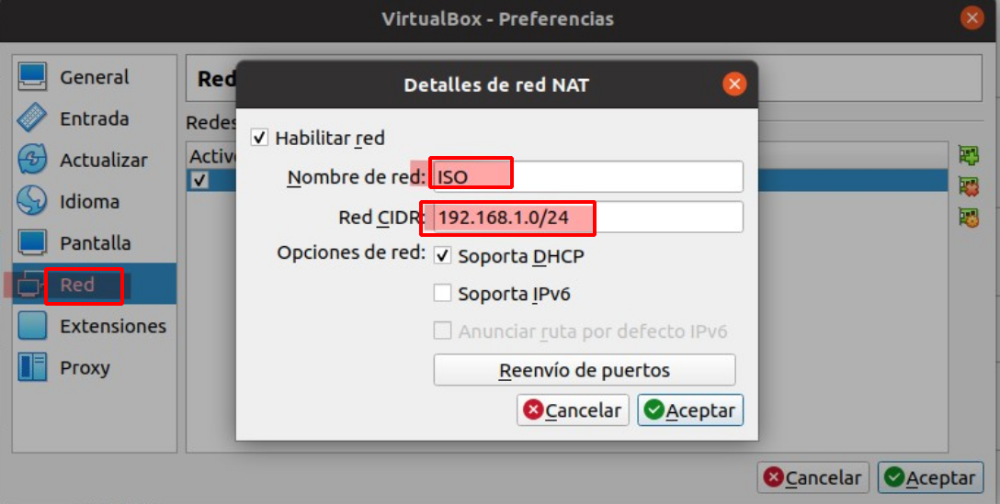
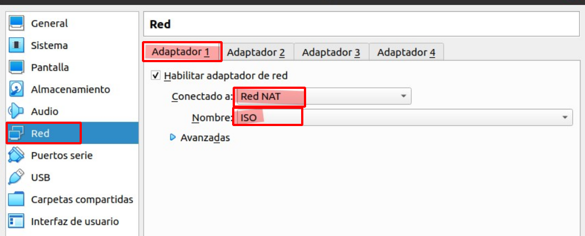

# Instalación de Controlador de Dominio en Winodws Server

## Indice 

## Definición 

Un **Controlador de Dominio en Windows Server** es un servidor que administra la autenticación de usuarios, autorización de accesos a recursos de red y la administración de políticas de grupo en un dominio de red. Al instalar un **Controlador de Dominio**, se establece una estructura jerárquica de dominios en la red, lo que permite centralizar la administración de usuarios, grupos y recursos de red. También facilita la implementación de políticas de seguridad y la replicación de información entre varios **Controladores de Dominio** en la red.

## 1. Máquina Virtual 

### 1.2 Configuración

Modificamos la memoria base vamos a utilizar , y añadimos 4GB para que este mejor 

Almacenamiento del disco duro , es de 100GB . Como se ve en la siguiente imagen 

Le cambiamos el nombre a la máquina virtual como se ve en la imagen 

## 2. Red NAT

## 2.1 Características 

Crear una red NAT con las siguientes características

- **Nombre :** ISO
- **Red :** 192.168.1.0
- **Mascara :** 255.255.255.

Y añadimos la máquina a la red ISO . Como podemos ver en la siguiente imagen , ya esta añadido correctamente

