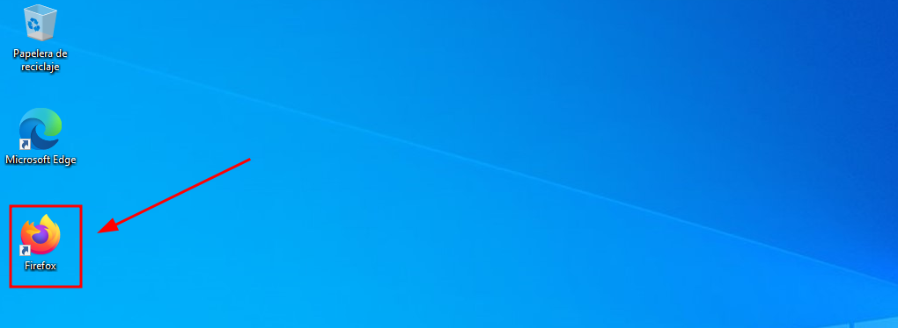

# 🚀 Instalación de Programas en Windows con Chocolatey
 

- [🚀 Instalación de Programas en Windows con Chocolatey](#-instalación-de-programas-en-windows-con-chocolatey)
  - [📦 Chocolatey](#-chocolatey)
    - [1. Instalación](#1-instalación)
    - [2. Instalación de Programas](#2-instalación-de-programas)

 

## 📦 Chocolatey
 

**``Chocolatey``** es un gestor de paquetes para Windows, similar a ``apt`` en Linux. Permite instalar y gestionar programas desde la terminal (PowerShell).

 

### 1. Instalación 
 

1 - Ve a la página oficial de [Chocolatey](https://chocolatey.org/install) , sigue los pasos marcados.

  

2 - Abrir ``PowerShell`` como administrador:

Busca PowerShell en el menú, haz clic derecho y selecciona "Ejecutar como administrador".

  

3 - Verificar la política de ejecución:

Para permitir la instalación de scripts, copia y ejecuta este comando para ver tu política actual:

~~~~
# Politicas de Ejecución
Get-ExecutionPolicy

# Clausula
Restricted
~~~~

  

3 - Cambiar la política de ejecución:

Cambia la política para permitir la ejecución de scripts firmados , Confirma escribiendo ``S (Sí)`` cuando te pregunte.

~~~~
Set-ExecutionPolicy AllSigned
~~~~

  

4 - Permitir la ejecución temporal para este proceso. Para evitar problemas, ejecuta este comando:

~~~~
ExecutionPolicy Bypass -Scope Process
~~~~

  

5 - Instalar Chocolatey:

Copia y ejecuta el script de instalación oficial desde la página de Chocolatey.

~~~~
Set-ExecutionPolicy Bypass -Scope Process -Force; [System.Net.ServicePointManager]::SecurityProtocol = [System.Net.ServicePointManager]::SecurityProtocol -bor 3072; iex ((New-Object System.Net.WebClient).DownloadString('https://community.chocolatey.org/install.ps1'))
~~~~

  

6 - Verificar instalación:

Escribe choco en la terminal para ver que está instalado y obtener la ayuda con

~~~~
choco -?
~~~~

  

### 2. Instalación de Programas
 

1 - Buscar paquetes para instalar:

Usa el comando para buscar paquetes. Espera a que termine la instalación.

  

2 - Instalar paquetes. Para instalar un programa, usa:

~~~~
choco install firefox
~~~~

  

3 - 🎉 ¡Listo! Con estos método esta correctamente instalado

