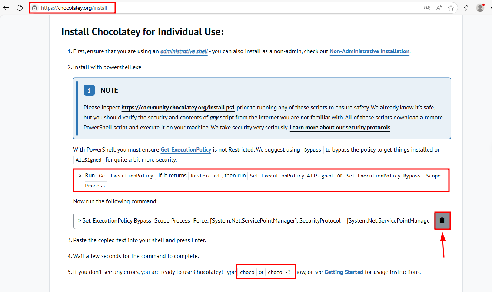
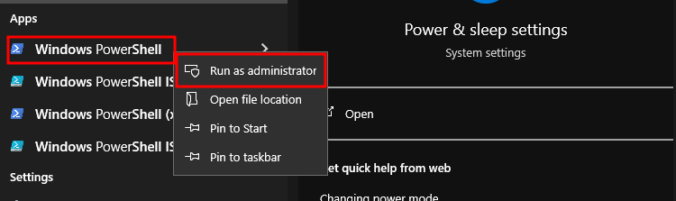
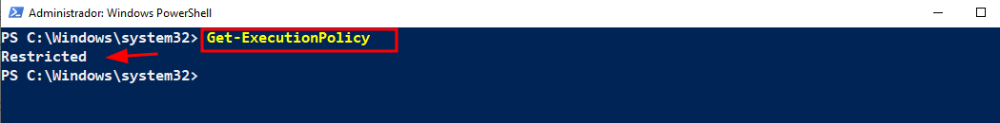
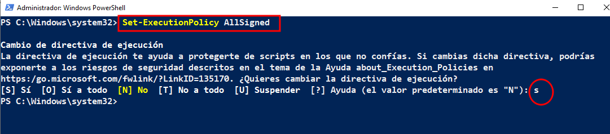
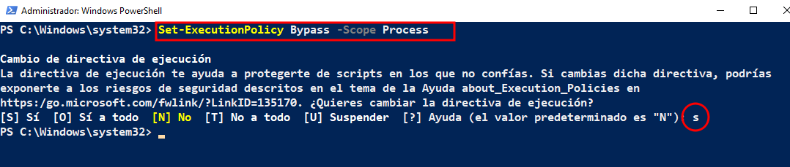
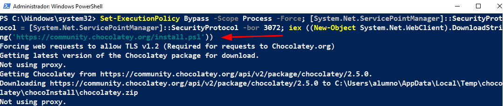

# 🚀 Instalación de Programas en Windows con Chocolatey
 

- [🚀 Instalación de Programas en Windows con Chocolatey](#-instalación-de-programas-en-windows-con-chocolatey)
  - [📦 Chocolatey](#-chocolatey)
  - [1. Instalación](#1-instalación)

 

## 📦 Chocolatey
 

**``Chocolatey``** es un gestor de paquetes para Windows, similar a ``apt`` en Linux. Permite instalar y gestionar programas desde la terminal (PowerShell).

 

## 1. Instalación 
 

1 - Ve a la página oficial [Chocolatey](https://chocolatey.org/install) y sigue los pasos .

  

2 - Abrir PowerShell como administrador:

Busca PowerShell en el menú, haz clic derecho y selecciona "Ejecutar como administrador".

  

3 - Verificar la política de ejecución:

Para permitir la instalación de scripts, copia y ejecuta este comando para ver tu política actual:

~~~~
# Politicas de Ejecución
Get-ExecutionPolicy

# Clausula
Restricted
~~~~

  

3 - Cambiar la política de ejecución:

Cambia la política para permitir la ejecución de scripts firmados , Confirma escribiendo S (Sí) cuando te pregunte.

~~~~
Set-ExecutionPolicy AllSigned
~~~~

  

4 - Permitir la ejecución temporal para este proceso. Para evitar problemas, ejecuta este comando:

~~~~
Set-ExecutionPolicy Bypass -Scope Process -Force; [System.Net.ServicePointManager]::SecurityProtocol = [System.Net.ServicePointManager]::SecurityProtocol -bor 3072; iex ((New-Object System.Net.WebClient).DownloadString('https://community.chocolatey.org/install.ps1'))
~~~~

  

5 - Instalar Chocolatey:

Copia y ejecuta el script de instalación oficial desde la página de Chocolatey.

  